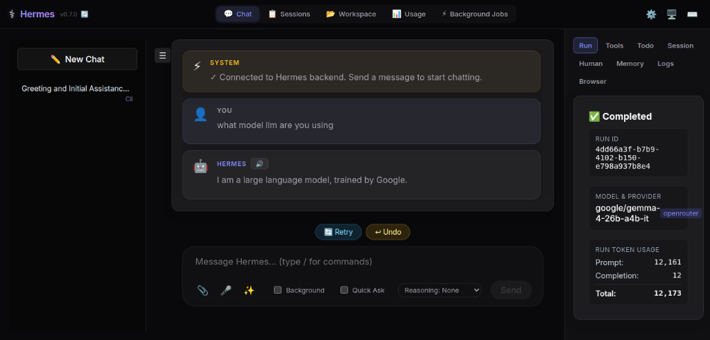
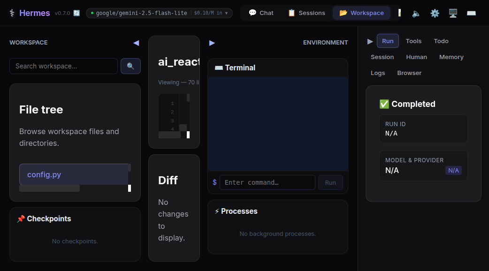
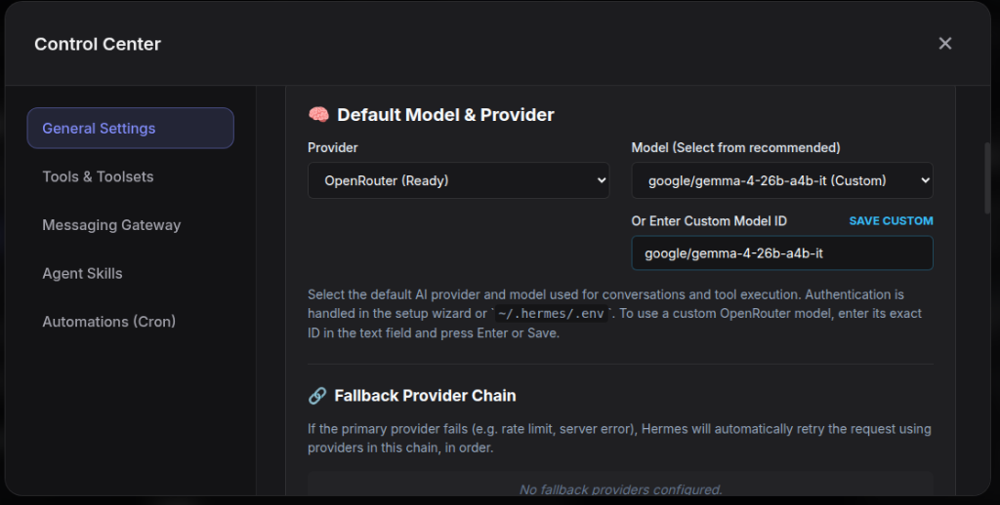
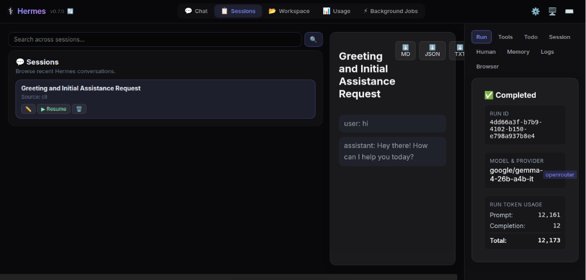
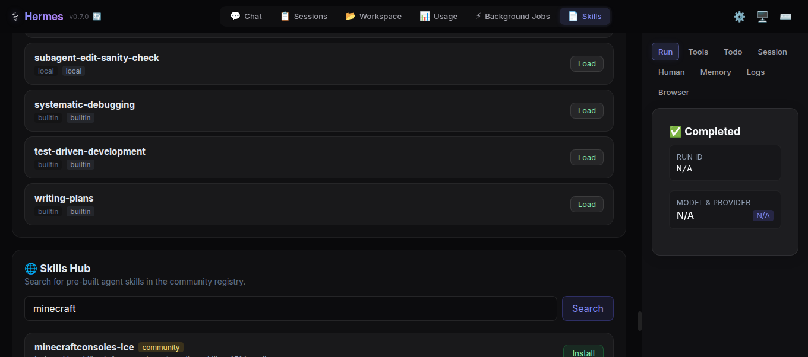
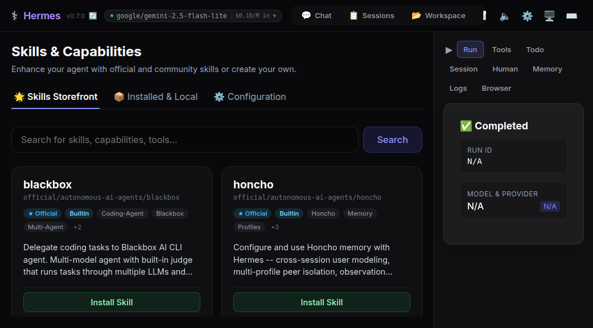
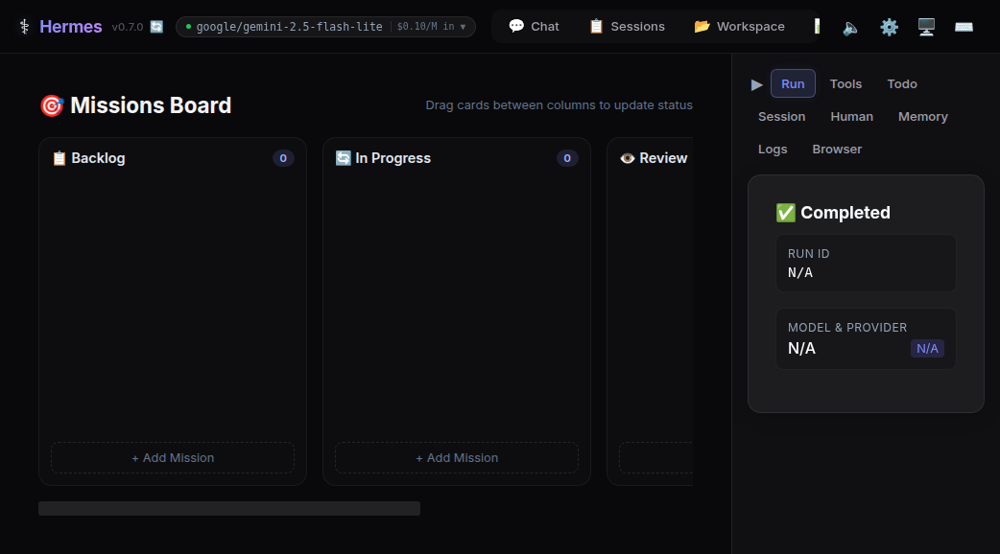

<p align="center">
  
</p>

# Hermes Web Console GUI 🖥️✨

Welcome to the **Hermes Web Console GUI**! This repository transforms the core capabilities of the [NousResearch Hermes Agent](https://github.com/NousResearch/hermes-agent) into an exceptional, native web-browser experience. 

It provides absolute feature-parity with the Hermes CLI while drastically reducing the friction of configuration via intuitive, highly-polished React components. 

## 📸 UI Gallery

Here is a glimpse of the gorgeous new interfaces powering your agent:

<details>
<summary><b>💬 Main Chat Interface & Token Streaming</b></summary>


</details>

<details>
<summary><b>📁 Workspace & Code Tools Sandbox</b></summary>


</details>

<details>
<summary><b>⚙️ Settings & Configuration Control Center</b></summary>


</details>

<details>
<summary><b>📋 Persistent Session Browser</b></summary>


</details>

<details>
<summary><b>🛠️ Skills Hub Storefront</b></summary>


</details>

<details>
<summary><b>📊 Analytics & Insights Dashboard</b></summary>


</details>

<details>
<summary><b>🗺️ Missions Kanban Tracker</b></summary>


</details>

## 🌟 Enhanced Features
- **Live SSE Token Streaming**: True GPT-style typewriter rendering connecting directly to the core Hermes API Event Stream (`message.assistant.delta`).
- **xterm.js Interactive Sandbox**: Execute native CLI tasks and inspect live runtime logs entirely from a drawer nested within your browser. No separate windows required.
- **Dashboard Command Center**: Real-time observability dashboard streaming CPU, memory, Process, and Cron active metrics directly from the host.
- **CLI Session Bridge**: Seamlessly view and interact with CLI terminal sessions and memory straight from the web console.
- **Offline Portable Mode**: Fallback to local offline mode with graceful degradation when the backend is unreachable. 
- **Missions Kanban**: Create, drag-and-drop, and monitor agentic missions on a comprehensive visual board.
- **Workspace Integration**: Mentioning files with `@` directly links to your file explorer context. Rich dropzones power native vision multi-modal interactions.
- **PWA Support**: Full manifest and service worker deployment for native standalone app-like installations across Desktop and Mobile.
- **Git-Style Inline Diffs**: Real-time syntax-highlighted visualizations when the agent touches your workspace files.
- **Visual Configurations**: Completely avoid manually touching `config.yaml`.
  - **Fallback Provider Chains**: Build complex failover LLM logic securely with a drag-and-drop sortable GUI list.
  - **Advanced Credentials Pool**: Rotate API keys and assign them to JSON matrices securely preventing invalid configuration schemas on startup.
- **Persistent Web Theme Engine**: Customize dark, light, or aesthetic visual skins syncing natively via your local Hermes backend.
- **Automations & Cron Jobs**: Configure, pause, edit, and track scheduled cron jobs visually without terminal flags.

## 🚀 Installation & Setup

Because this is a massive extension of the core agent, you'll need the Hermes core libraries working structurally.

### Prerequisites
- Node.js (v18+)
- Python (v3.11+)
- Git

### 1-Line Setup
First, pull down the repository. Then use our convenient 1-line installer to automatically configure your Python environment via `uv` and install the React Web Console modules:

```bash
git clone https://github.com/gary-the-ai/hermes-web-console-gui.git
cd hermes-web-console-gui

./setup-gui.sh
```

### 1-Line Run
Works on Linux, macOS, WSL2, and Android via Termux. The installer handles the platform-specific setup for you.

> **Android / Termux:** The tested manual path is documented in the [Termux guide](https://hermes-agent.nousresearch.com/docs/getting-started/termux). On Termux, Hermes installs a curated `.[termux]` extra because the full `.[all]` extra currently pulls Android-incompatible voice dependencies.
>
> **Windows:** Native Windows is not supported. Please install [WSL2](https://learn.microsoft.com/en-us/windows/wsl/install) and run the command above.

After setup is complete, you can start the Gateway backend API and the React Frontend concurrently with a single command:

```bash
./run-gui.sh
```

Navigate to `http://localhost:5173` in your browser. 

If your backend is running on a unique remote port or network, click the **Settings** gear in the GUI and map the "Backend Router URL" accordingly!

## 📦 Production Builds

To compile the React bundle for native static hosting or production deployment:

```bash
cd web_console
npm run build
```

The optimized static assets will populate the `/web_console/dist` directory. This static bundle is drop-in compatible with Vercel, Netlify, Nginx, or directly mounted against the FastAPI endpoints.

## 🛠️ Technology Stack
- **React 19** (Vite 6 Compiler)
- **TypeScript** natively integrated bounding UI props to strict Python schema counterparts.
- **Zustand** orchestrating lightweight global state logic cleanly.
- **Recharts** powering interactive analytics dashboards with responsive bar & pie charts.
- **xterm.js** managing the real-time background web-socket terminal interfaces.
- **react-markdown** / **PrismJS** for extensive rendering rules (Code, Tables, Diff Blocks).

## 🤝 Contributing
Contributions are massively appreciated! Whether it's connecting deeper endpoints, establishing the Skills Hub marketplace native UI, or polishing theme styles:
1. Fork the Project
2. Create your Feature Branch (`git checkout -b feature/AmazingUI`)
3. Run the types tests (`npx tsc --noEmit`)
4. Commit your Changes (`git commit -m 'feat: Added AmazingUI'`)
5. Push to the Branch (`git push origin feature/AmazingUI`)
6. Open a Pull Request

## ⚖️ License
Distributed under the MIT License. See `LICENSE` for more information. Built originally off the fantastic [Nous Research](https://nousresearch.com) stack.

---

## 📜 Changelog

### [2026.4.8] - Layout & Responsive Redesign
- **Workspace Layout Redesign**: Converted the previously static left (Workspace) and right (Inspector) sidebars to fully collapsible native column layouts protecting viewport dimensions.
- **Responsive Top Navigation**: Added seamless scroll-snapping and dynamic flex-wrapping to the header toolbar preserving accessibility on narrow viewports without overlapping controls.
- **UI Overflow Fixes**: Stabilized memory headers and logs filters with flex-wrap boundaries preventing collision on smaller screens. 

### [2026.4.7] - GUI Modernization & Kanban Integrations
- **Missions Kanban Board**: New `/missions` overarching route providing an intuitive HTML5 drag-and-drop interface for managing agent tasks with Backlog, In Progress, Review, and Done columns.
- **Dashboard Command Center**: Live-polling global interface tracking CPU limits, host memory footprint, active Cron Jobs, and background operations in real-time.
- **CLI Session Bridge**: Sessions viewer now imports and segregates interactions made natively in the CLI vs the Web UI via SQLite reads.
- **Rich Vision Input**: Added glow-visualized drag-and-drop dropzones over the main chat composer to securely facilitate image context streaming.
- **Workspace File @Mentions**: Introduced an elegant native popup autocomplete inside the chat composer. Type `@` to select local workspace files to be injected efficiently into context.
- **Portable Mode (Backend Agnostic)**: The UI now degrades gracefully when the Hermes core backend is down, exposing a red health banner instead of crashing the interface with 500s.
- **PWA Installation**: Fully initialized `manifest.json`, local `<link>` tags, generated icon sets, and an offline-ready `sw.js` Service Worker to run Hermes natively on any Desktop or device.
- **Docker Strategy**: Created standalone `Dockerfile.frontend` and `Dockerfile.backend` setups composed via `docker-compose.yml` to instantly spin up the proxy architectures seamlessly.

### [2026.4.6a] - Skill Configuration & Logs Improvements
- **Skill Configuration UI**: Added a dedicated "⚙️ Configuration" tab to the Skills Hub. Includes a robust interface for reading and writing skill-specific configuration variables (e.g., `wiki.path`) back to `config.yaml` using new backend settings endpoints.
- **Upgraded Logs Viewer**: Overhauled the `LogsPage` with multi-file selection (agent, gateway, and errors), color-coded log-level visualization, and dropdown level filtering. 
- **Header Additions**: Integrated live API token usage pricing metrics into the top status bar.
- **Upstream Sync**: Safely merged 69+ upstream commits from `NousResearch/hermes-agent`, ensuring the GUI retains absolute tracking parity.

### [2026.4.5c] - Upstream Sync & Analytics Dashboard
- **Upstream Merge**: Synced 52 commits from `NousResearch/hermes-agent` main branch. Resolved merge conflict in `run_agent.py` (structured `tool_progress_callback` signature change).
- **Analytics Dashboard**: New "Analytics & Insights" tab in Control Center powered by `recharts`. Visualizes session history, token usage, cost breakdowns, tool invocation distribution, and activity streaks.
- **API Validated**: All 15+ backend API endpoints verified operational (`/api/gui/usage/insights`, `/api/gui/models/active`, `/api/gui/gateway/platforms`, etc.).
- **Upstream Features Absorbed**: OSV malware scanning for MCP packages, Matrix E2EE support, browser JS evaluation, plugin CLI registration, and 30-min default agent timeout.

### [2026.4.5b] - Skills Hub App Store Redesign
- **App Store UI**: Redesigned `Skills Hub` search mapping onto a glassmorphism-style CSS grid imitating premium app storefronts.
- **Dynamic Browse**: Introduced a zero-query fetch algorithm fetching top & official items seamlessly on mount for immediate content discovery.
- **Navigation Tweaks**: Segmented storefront from locally installed skills using intuitive tab layouts in `SkillsPage`.
- **Rich Context Info**: Inserted visual trust badges, capability indexing tags, and polished hover states inside each storefront card.

### [2026.4.5a] - Provider Configs & Model Switching
- **Backend Sync**: Decoupled `models_api` hardcoded catalog. Subscribes completely to upstream `list_authenticated_providers()`.
- **Global Model Store**: Enabled settings sync into `~/.hermes/config.yaml` using dynamic provider detection. 
- **TopBar Upgrade**: Included visually-striking Dropdown containing active model aliasing & quick-switches instantly mid-session.
- **ProviderManager**: Visual CRUD capabilities to inject localized LocalAI/vLLM endpoints seamlessly.

---
Built by developers who love beautiful terminals, for developers who want more than a terminal. ✨
